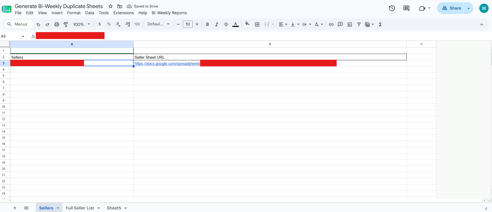
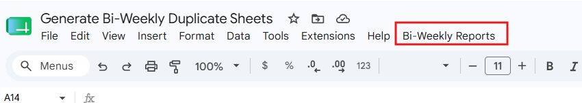
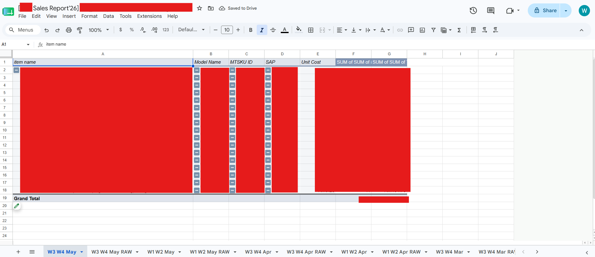
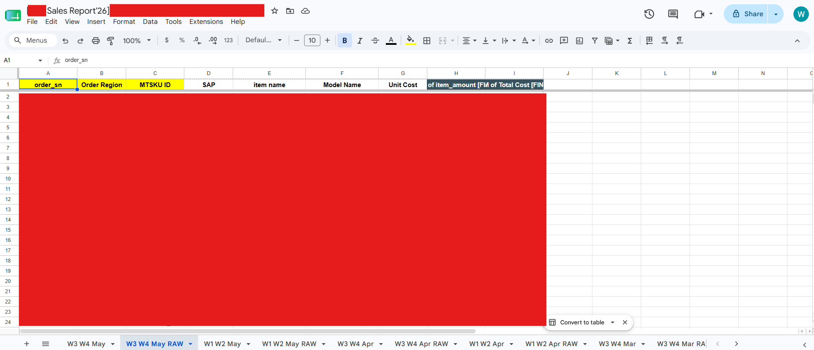
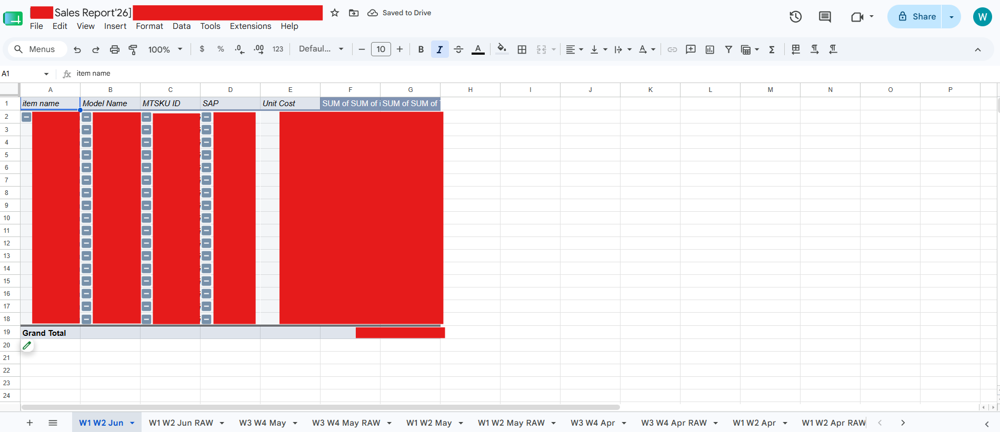
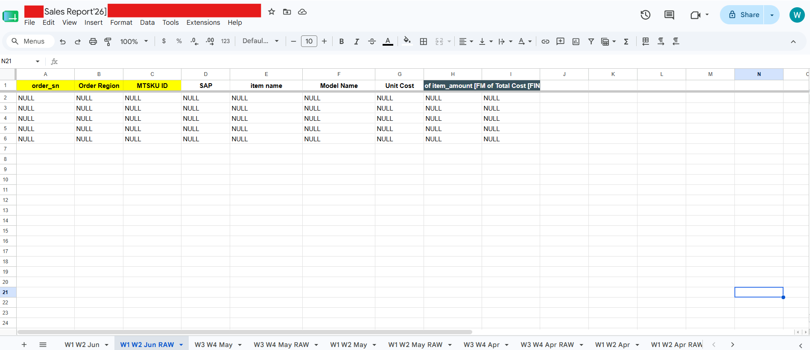

# Automated Reporting Cycle Generator (Google Apps Script)

A Google Apps Script automation that generates new reporting cycle templates across multiple Google Spreadsheets. The script copies the latest reporting structure, resets existing data, and prepares the next reporting cycle automatically for multiple sellers.

---

## Features

- Automatically generates new reporting cycle templates
- Copies the latest Report and RAW sheets
- Resets data while preserving the reporting structure
- Maintains consistent sheet naming and ordering
- Processes multiple seller spreadsheets from a centralized Master List

---

## Reporting Periods

| Report | Reporting Period |
|--------|------------------|
| W1 W2 | 1st – 15th of the month |
| W3 W4 | 16th – End of the month |

## Template Generation Logic

Templates are generated based on when the reporting data becomes available.

| Script Run Period | Template Generated |
|-------------------|--------------------|
| 1st – 14th | Previous month's **W3 W4** template |
| 15th – End of month | Current month's **W1 W2** template |

**Example**

- Running the script on **8 July** generates **W3 W4 Jun**.
- Running the script on **20 July** generates **W1 W2 Jul**.

---

## How It Works

1. Reads the **Master List** containing seller names and spreadsheet URLs.
2. Opens each seller's spreadsheet.
3. Identifies the latest Report and RAW sheets.
4. Copies and renames both sheets for the new reporting cycle.
5. Clears existing report data.
6. Resets the RAW sheet with placeholder values.
7. Reorders the newly created sheets to maintain a consistent structure.

---

## Setup

1. Open **Google Sheets → Extensions → Apps Script**.
2. Paste the script into `Code.gs`.
3. Ensure a sheet named **Master List** exists.
4. Populate the Master List with the seller names and corresponding spreadsheet URLs for the current reporting cycle.
5. Run `generateNewReportingCycle()`.

---

## Notes

- Report sheet names must follow the format: `W1 W2 Jan`.
- RAW sheet names must end with `RAW`.
- Each spreadsheet must contain at least one previous reporting cycle to be used as a template.
- The Master List is updated manually at the beginning of each reporting cycle, as the number of sellers may vary.

---

## Master List Structure

The Master List serves as the control sheet for the automation. It contains the seller names and their corresponding spreadsheet URLs for the current reporting cycle.

| Seller Name | Spreadsheet URL |
|-------------|-----------------|
| Seller A | https://... |
| Seller B | https://... |

---

## Screenshots

### Master List

### Sheet Generation Menu Button

### Before (Report Sheet)

### Before (RAW Sheet)

### After (Report Sheet)

### After (RAW Sheet)

---

## Skills Demonstrated

- Google Apps Script (JavaScript)
- Spreadsheet Automation
- Workflow Automation
- Data Processing
- Dynamic File Handling
- Batch Processing
- Error Handling
- Modular Programming
- Google Sheets API
